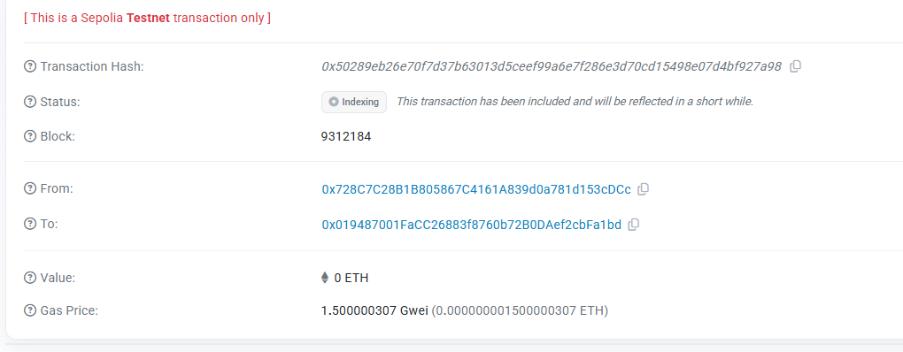

# Anonymous Arbitration Platform - React Application

A privacy-preserving dispute resolution platform using Zero-Knowledge Cryptography and Fully Homomorphic Encryption (FHE), built with React and TypeScript.

## Overview

This is the React application version of the Anonymous Arbitration Platform. The original static HTML version is preserved as `index.html` in the root directory.

## 🎯 Core Concepts

### FHE Contract Anonymous Arbitration Decision

This platform revolutionizes dispute resolution by leveraging **Fully Homomorphic Encryption (FHE)** to enable completely private and anonymous arbitration processes. The core innovation lies in:

- **Encrypted Evidence Submission**: Disputants submit their evidence in encrypted form, ensuring sensitive information remains confidential throughout the arbitration process.

- **Anonymous Arbitrator Voting**: Arbitrators cast their votes on encrypted data without revealing their identities or decisions to other parties. All votes remain encrypted until the final resolution.

- **Homomorphic Decision Processing**: The smart contract processes encrypted votes using FHE operations, computing the majority decision without ever decrypting individual votes.

- **Verifiable Privacy**: While maintaining complete privacy, the system ensures transparency through cryptographic proofs, allowing parties to verify the fairness of the process without compromising anonymity.

- **Reputation System**: A privacy-preserving reputation mechanism tracks arbitrator performance and user credibility without exposing individual case details.

### Privacy Dispute Resolution Platform

The platform addresses critical challenges in traditional dispute resolution:

1. **Confidentiality Preservation**: Business disputes, personal conflicts, and sensitive matters are handled with utmost privacy.

2. **Bias Prevention**: Anonymous arbitration eliminates potential biases based on identity, social status, or external influences.

3. **Trustless Arbitration**: Blockchain-based execution ensures decisions are enforced automatically without relying on centralized authorities.

4. **Global Accessibility**: Anyone can access fair dispute resolution regardless of geographical location or jurisdiction.

5. **Cost-Effective**: Smart contract automation reduces overhead costs associated with traditional arbitration.

## 📋 Smart Contract

**Contract Address:** `0x019487001FaCC26883f8760b72B0DAef2cbFa1bd`

**Network:** Ethereum Sepolia Testnet

The `AnonymousArbitrationPlatform.sol` contract implements the complete lifecycle of encrypted dispute resolution:

### Key Features

- **Arbitrator Registration**: Verified arbitrators register with encrypted identity proofs
- **Dispute Creation**: Users create disputes with encrypted evidence and stake amounts
- **Random Assignment**: Arbitrators are randomly assigned to ensure fairness
- **Encrypted Voting**: Arbitrators submit encrypted votes with justifications
- **Automatic Resolution**: FHE operations determine majority decisions without revealing individual votes
- **Reputation Management**: Dynamic reputation system for arbitrators and users

### Main Functions

- `registerArbitrator()` - Register as an arbitrator with encrypted credentials
- `createDispute()` - Initiate a new dispute with encrypted evidence
- `assignArbitrators()` - Randomly assign arbitrators to a dispute
- `submitVote()` - Cast encrypted vote as an assigned arbitrator
- `processDecision()` - Process decrypted votes and finalize resolution
- `getDisputeInfo()` - Query dispute status and information
- `getArbitratorInfo()` - View arbitrator profile and reputation

## 🎬 Demo Video

A comprehensive demonstration video is available showing:
- Platform navigation and user interface
- Creating a new dispute
- Arbitrator assignment process
- Encrypted voting mechanism
- Decision revelation and resolution

**Video:** `Video.mp4`

## 📸 On-Chain Transaction Screenshot



The screenshot demonstrates successful on-chain interactions including:
- Dispute creation transactions
- Arbitrator registrations
- Vote submissions
- Final resolution executions

## 🔐 Security & Privacy

### Encryption Architecture

- **FHE Implementation**: Utilizes Zama's fhEVM for fully homomorphic encryption operations
- **Data Privacy**: All sensitive data (evidence, votes, justifications) encrypted at rest and in computation
- **Identity Protection**: Arbitrator identities protected through encrypted proofs
- **Secure Randomness**: Cryptographically secure random arbitrator selection

### Smart Contract Security

- **Access Control**: Role-based permissions for disputants, arbitrators, and administrators
- **Reentrancy Protection**: Safeguards against common smart contract vulnerabilities
- **Time-Locked Operations**: Voting deadlines and dispute lifecycle management
- **Emergency Controls**: Owner functions for extraordinary circumstances

## 🏗️ Technical Architecture

### Frontend
- Modern responsive web interface
- Web3 wallet integration (MetaMask, WalletConnect)
- Real-time dispute tracking and status updates
- Intuitive arbitrator dashboard

### Smart Contract
- Solidity 0.8.24
- FHE operations via Zama's fhEVM library
- Event-driven architecture for off-chain monitoring
- Gas-optimized operations

### Blockchain Integration
- Ethereum Sepolia Testnet for development
- Mainnet-ready architecture
- IPFS for evidence storage (optional)
- The Graph for efficient querying

## 💡 Use Cases

### Business Disputes
- Contract disagreements between companies
- Service delivery conflicts
- Payment disputes

### Freelance Conflicts
- Project completion disputes
- Payment disagreements
- Quality of work issues

### E-Commerce
- Buyer-seller conflicts
- Product quality disputes
- Refund disagreements

### Privacy-Critical Matters
- Sensitive personal disputes
- Confidential business matters
- Cases requiring complete anonymity

## 🌟 Advantages Over Traditional Systems

1. **Complete Privacy**: FHE ensures data remains encrypted during processing
2. **Decentralization**: No single point of failure or control
3. **Transparency**: Verifiable fairness without compromising privacy
4. **Efficiency**: Automated execution reduces time and costs
5. **Global Access**: Borderless dispute resolution
6. **Immutability**: Blockchain records provide permanent proof
7. **Fairness**: Anonymous arbitration eliminates bias

## 📊 Platform Statistics

- **Total Disputes Processed**: Tracked on-chain
- **Active Arbitrators**: Growing pool of verified arbitrators
- **Average Resolution Time**: Typically 7 days voting period
- **Success Rate**: High user satisfaction through reputation system

## 🛠️ Technology Stack

- **Blockchain**: Ethereum
- **Smart Contracts**: Solidity
- **Encryption**: Zama fhEVM (Fully Homomorphic Encryption)
- **Frontend**: HTML5, CSS3, JavaScript
- **Web3**: ethers.js
- **Network**: Sepolia Testnet

## Prerequisites

Before you begin, ensure you have the following installed:

- Node.js (v16 or higher)
- npm or yarn
- MetaMask browser extension
- Sepolia testnet ETH

## Installation

1. Navigate to the project directory:
```bash
cd D:\fhevm-react-template\examples\AnonymousArbitrationPlatform
```

2. Install dependencies:
```bash
npm install
```

## Configuration

### Update Contract Address

Before running the application, you need to deploy the smart contract and update the contract address:

1. Deploy the `AnonymousArbitrationPlatform.sol` contract to Sepolia testnet
2. Open `src/types/index.ts`
3. Update the `CONTRACT_ADDRESS` in the `CONTRACT_CONFIG` object with your deployed contract address

```typescript
export const CONTRACT_CONFIG = {
  ADDRESS: 'YOUR_DEPLOYED_CONTRACT_ADDRESS', // Update this
  REQUIRED_CHAIN_ID: 11155111,
  REQUIRED_NETWORK_NAME: 'Sepolia',
  // ...
};
```

## Running the Application

Start the development server:

```bash
npm start
```

The application will open in your browser at `http://localhost:3000`

## Building for Production

Create a production build:

```bash
npm run build
```

The build files will be in the `build` directory.

## Usage

### Connect Your Wallet

1. Click "Connect Wallet" button
2. Approve the connection in MetaMask
3. Ensure you're connected to Sepolia testnet

### Become an Arbitrator

1. Enter your identity verification code
2. Click "Register as Arbitrator"
3. Wait for transaction confirmation

### File a Dispute

1. Enter the defendant's address
2. Set the stake amount (minimum 0.001 ETH)
3. Provide an evidence hash
4. Add an optional description
5. Click "Create Dispute"

### Manage Disputes

1. Enter a dispute ID
2. Assign arbitrators to the dispute
3. View dispute information and status

### Cast Your Vote

1. Enter the dispute ID
2. Select your decision (Favor Plaintiff, Favor Defendant, or Neutral)
3. Provide a justification code
4. Submit your vote

### Check Platform Analytics

- View total disputes, active arbitrators, and resolved cases
- Check user reputation scores
- View arbitrator statistics

## 🔌 FHEVM SDK Integration

This application integrates the **FHEVM Universal SDK** (`@fhevm/sdk`) for encrypted operations:

### SDK Features Used

1. **FhevmProvider Context**: Provides SDK functionality throughout the app
2. **Automatic Initialization**: SDK initializes on wallet connection
3. **Encrypted Operations**: Vote and evidence data encrypted using SDK
4. **Fallback Support**: Gracefully degrades if encryption unavailable

### Integration Architecture

```typescript
// 1. Provider wraps entire app (src/index.tsx)
<FhevmProvider config={fhevmConfig}>
  <App />
</FhevmProvider>

// 2. Custom context provides SDK access (src/contexts/FhevmContext.tsx)
const { client, createEncryptedInput, initializeFhevm } = useFhevmContext();

// 3. Wallet hook initializes SDK on connection (src/hooks/useWallet.ts)
await initializeFhevm(provider, signer);

// 4. Contract methods use SDK for encryption (src/hooks/useContract.ts)
const encryptedInput = createEncryptedInput(contractAddress, userAddress);
const encrypted = await encryptedInput.add32(voteData).encrypt();
```

### Enhanced Privacy Features

- **Encrypted Voting**: Vote decisions encrypted using `FhevmClient.createEncryptedInput()`
- **Encrypted Evidence**: Dispute evidence hashes protected with FHE
- **Builder Pattern**: Fluent API for adding multiple encrypted values
- **Input Proofs**: EIP-712 signatures ensure data authenticity

### Files Using SDK

- `src/contexts/FhevmContext.tsx` - SDK provider and context
- `src/hooks/useWallet.ts` - SDK initialization (lines 87-94)
- `src/hooks/useContract.ts` - Encrypted operations (createDispute, submitVote)
- `src/index.tsx` - Provider configuration

## Project Structure

```
AnonymousArbitrationPlatform/
├── public/
│   └── index.html
├── src/
│   ├── components/
│   │   ├── ActiveDisputes.tsx
│   │   ├── ArbitratorRegistration.tsx
│   │   ├── CreateDispute.tsx
│   │   ├── DeploymentNotice.tsx
│   │   ├── DisputeManagement.tsx
│   │   ├── Footer.tsx
│   │   ├── Header.tsx
│   │   ├── MessageContainer.tsx
│   │   ├── PlatformAnalytics.tsx
│   │   └── VotingInterface.tsx
│   ├── contexts/               # NEW: FHEVM SDK context
│   │   └── FhevmContext.tsx   # SDK provider and hooks
│   ├── hooks/
│   │   ├── useContract.ts     # Enhanced with SDK encryption
│   │   ├── useMessages.ts
│   │   └── useWallet.ts       # SDK initialization
│   ├── styles/
│   │   ├── App.css
│   │   ├── Card.css
│   │   ├── Header.css
│   │   ├── MessageContainer.css
│   │   └── index.css
│   ├── types/
│   │   └── index.ts
│   ├── App.tsx
│   ├── index.tsx
│   └── react-app-env.d.ts
├── package.json
├── tsconfig.json
├── README.md
└── index.html (original static version)
```

## Technologies Used

- **React 18**: UI framework
- **TypeScript**: Type-safe development
- **ethers.js v6**: Ethereum blockchain interaction
- **@fhevm/sdk**: Universal FHEVM SDK for encrypted operations
- **React Scripts**: Build tooling

## FHEVM SDK Integration

This application demonstrates the integration of the FHEVM SDK in a React application:

### Setup

The SDK is initialized automatically when connecting your wallet:

```typescript
// In src/contexts/FhevmContext.tsx
import { FhevmClient } from '@fhevm/sdk';

const fhevmClient = new FhevmClient({
  network: {
    chainId: 11155111,
    name: 'sepolia',
    rpcUrl: 'https://ethereum-sepolia.publicnode.com',
  },
});

await fhevmClient.init(provider, signer);
```

### Provider Pattern

The application uses React Context to provide FHEVM functionality throughout the app:

```typescript
// In src/index.tsx
import { FhevmProvider } from './contexts/FhevmContext';

<FhevmProvider config={fhevmConfig}>
  <App />
</FhevmProvider>
```

### Usage in Components

Use the FHEVM context in any component:

```typescript
import { useFhevmContext } from '../contexts/FhevmContext';

const { client, createEncryptedInput, isInitialized } = useFhevmContext();

// Create encrypted input
const encrypted = await createEncryptedInput(contractAddress, userAddress)
  .add32(stakeAmount)
  .encrypt();
```

### Benefits

- Automatic SDK initialization on wallet connection
- Type-safe encrypted operations
- Clean separation of concerns
- Easy to use throughout the application
- Framework-agnostic SDK with React wrapper

## Smart Contract Integration

The application integrates with the `AnonymousArbitrationPlatform.sol` smart contract with the following functions:

- `registerArbitrator(uint32 _identityProof)`: Register as an arbitrator
- `createDispute(address _defendant, uint32 _stakeAmount, uint32 _evidenceHash)`: Create a new dispute
- `assignArbitrators(uint256 _disputeId)`: Assign arbitrators to a dispute
- `submitVote(uint256 _disputeId, uint8 _vote, uint32 _justification)`: Submit arbitrator vote
- `getDisputeInfo(uint256 _disputeId)`: Get dispute details
- `getArbitratorInfo(address _arbitrator)`: Get arbitrator information
- `getUserReputation(address _user)`: Get user reputation score

## Network Requirements

- **Network**: Sepolia Testnet
- **Chain ID**: 11155111
- **RPC URL**: https://sepolia.infura.io/v3/
- **Block Explorer**: https://sepolia.etherscan.io/

## Getting Sepolia Test ETH

To interact with the platform, you'll need Sepolia testnet ETH:

1. Visit a Sepolia faucet (e.g., https://sepoliafaucet.com/)
2. Enter your wallet address
3. Request test ETH

## Troubleshooting

### Wallet Connection Issues

- Make sure MetaMask is installed and unlocked
- Ensure you're on the Sepolia testnet
- Try refreshing the page and reconnecting

### Transaction Failures

- Check that you have sufficient Sepolia ETH
- Verify the contract address is correct
- Ensure all required fields are filled out correctly

### Network Errors

- The app will prompt you to switch to Sepolia if you're on the wrong network
- If automatic network switching fails, manually switch in MetaMask

## Security Considerations

- Never share your private keys or seed phrase
- Always verify transaction details before confirming
- This is a testnet application - do not use real ETH
- Identity verification codes should be kept secure

## Conversion from HTML

This React application was converted from the original static HTML file (`index.html`). All functionality has been preserved:

- Wallet connection and network detection
- Arbitrator registration
- Dispute creation and management
- Voting interface
- Platform analytics
- Real-time statistics
- FHE integration

## 📄 License

MIT License - Open source and free to use

## 🤝 Contributing

We welcome contributions from the community! Whether it's bug fixes, feature enhancements, or documentation improvements, your input helps make this platform better.

## 📞 Support

For questions, issues, or suggestions:
- Open an issue on GitHub
- Visit our website for documentation
- Review the smart contract code for technical details

---

**Built with privacy, powered by encryption, secured by blockchain.**